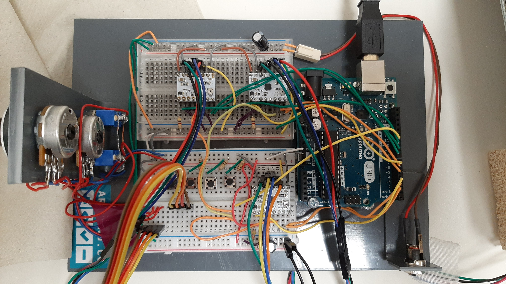

# PrickMotor 2

This is the code for the Arduino-microcontroller which powered the MEG-compatible Pinprick-Stimualator in it's second revision.
It received input signals via the MEG-labs trigger system and controlled three motors for moving the Pinprick.
It also has a built-in calibration routine.

## Wiring for PrickMotor2

## Motors and Arduino

